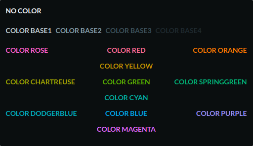
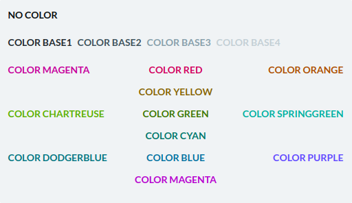

# Terminal Colorscheme Neutral

Colorscheme for terminal emulators with neutral, readable colors

Compatible with:

- Windows Terminal
- Tilix
- Termux

### Dark Variant



```json
{
  "foreground": "#F0F3F5",
  "brightWhite": "#c3cfd5", // COLOR BASE1
  "white": "#879fab", // COLOR BASE2
  "brightBlack": "#3E525B", // COLOR BASE3
  "black": "#1f292e", // COLOR BASE4
  "background": "#0A0E0F",

  "red": "#ff6c91",
  "yellow": "#c59700",
  "green": "#55b200",
  "cyan": "#00b1a4",
  "blue": "#00a7f0",
  "violet": "#ea65ff",

  "brightRed": "#ff60cc",    // MAGENTA
  "brightYellow": "#f77b00", // ORANGE
  "brightGreen": "#9da500",  // CHARTREUSE
  "brightCyan": "#00b47d",   // SPRINGGREEN
  "brightBlue": "#00aec1",   // DODGERBLUE
  "brightViolet": "#9e8eff"  // VIOLET
}
```

### Light Variant



```json
{
    "foreground": "#0A0E0F",
    "brightWhite": "#1f292e", // COLOR BASE1
    "white": "#3E525B", // COLOR BASE2
    "brightBlack": "#879fab", // COLOR BASE3
    "black": "#c3cfd5", // COLOR BASE4
    "background": "#F0F3F5",

    "red": "#d3005a",
    "yellow": "#866600",
    "green": "#387900",
    "cyan": "#00786f",
    "blue": "#0071a4",
    "purple": "#b800cc",

    "brightRed": "#c80099",    // MAGENTA
    "brightYellow": "#a95200", // ORANGE
    "brightGreen": "#6a6f00",  // CHARTREUSE
    "brightCyan": "#007a53",   //SPRINGGREEN
    "brightBlue": "#007684",   //DODGERBLUE
    "brightPurple": "#6c44ff", // VIOLET
}
```
